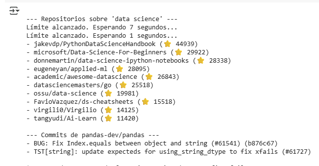
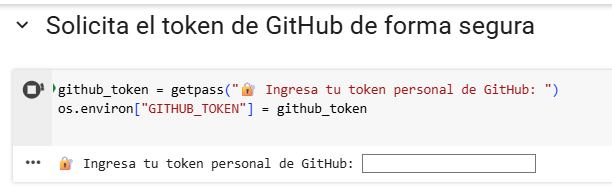

# 📊 Data Source API Analyst - GitHub API Homework 
## Homework assignment for Data Source API Analyst role

  

 
---
This repository contains the completed technical test for the **Data Source API Analyst** role.  
The project demonstrates API research, data extraction, error handling, documentation, and results export using GitHub's REST API.
---

## 🎯 Objective

The goal of this assignment is to assess:
- Understanding of **APIs**
- Ability to extract and structure data programmatically
- Capacity to document, troubleshoot, and deliver results using tools like **Postman** or **Google Colab**
---

## 🧭 Task Overview

✅ Research GitHub API  
✅ Test using Google Colab (Python-based extraction)  
✅ Document endpoints and logic  
✅ Handle pagination, authentication, and rate limits  
✅ Export data to CSV for validation  
✅ Provide troubleshooting guidance
---
## 🧩 Step 1: Prepare & Test a List of Reports
### Client Needs:
- 🔍 Search Public Repositories → `/search/repositories`
- 📄 List Commits in a Repository → `/repos/{owner}/{repo}/commits`
- 📁 Retrieve Repository Contents → `/repos/{owner}/{repo}/contents/{path}`

## 💻 Tools Used

- **Google Colab** (bonus points) for endpoint testing and scripting
- **Python + requests + pandas** for API extraction and export
- **Markdown** for all documentation
---
## 📥 Output Files (CSV)

**repositorios.csv** includes:
- `repo_name`, `repo_full_name`, `owner`, `stars`, `forks`, `created_at`, `updated_at`, `url`, `description`

**commits.csv** includes:
- `commit_sha`, `commit_message`, `commit_author`

You can download these from the Colab session or from the repository directly.

  
  

---
## 🚨 Troubleshooting Summary

- **401 Unauthorized**: Check token and permissions
- **403 Rate Limit**: Handled with delay logic based on `X-RateLimit-Reset`
- **404 Not Found**: URL paths and repo names validated manually
---

## 🤔 Reflection

Even without prior API experience, I was able to:
- Read API docs and test different endpoints
- Authenticate using personal tokens securely
- Handle rate limits and pagination
- Export real data into reusable `.csv` files
- Understand the basics of building reliable API clients

This exercise greatly improved my confidence working with public APIs and troubleshooting real-world issues.

---

**Author:** Patricia Morales Serrano  
**Date:** July 2025  
**Role:** Data Source API Analyst Applicant

---

Gracias por la oportunidad y por revisar este proyecto 🙌🏼
